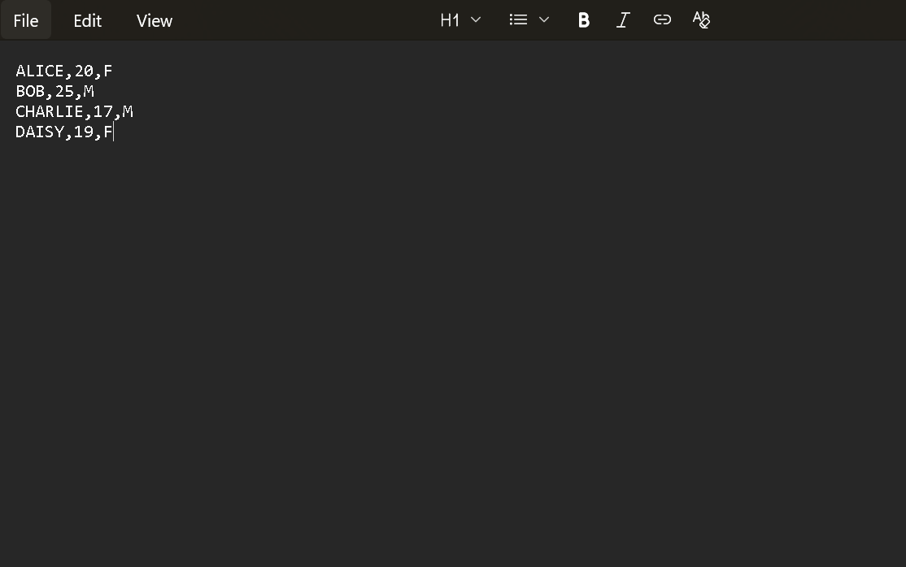
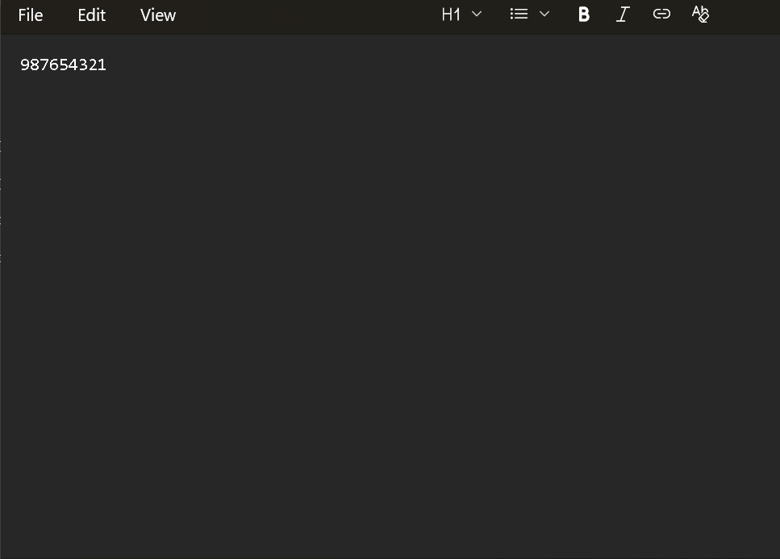
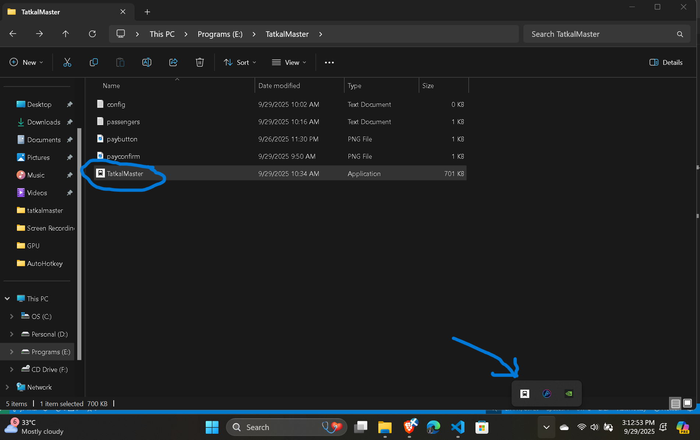

# tatkalmaster-public
An Application to enable faster form filling during Tatkal Ticket booking
This script is used to fill the passenger details fields which are preloaded and directly jump to the review journey details page

Steps to run:

Step 1 : Download and Extract the TatkalMaster.7z file.

Step 2 : modify the passengers.txt. Maintain it like a csv format separating by commas
         The neccessary fields should be filled in this format
         Name1,age1,gender1(M or F)
         Name2,age2,gender2(M or F)
         ex: Alice,17,F
             Bob,20,M

         If you want to add berth preferences like WindowSide, Lower,Middle,Upper, fill the details in this format type exactly form the preference list
         Preference list
         'Window Side'(only for second sitting(2S) trains)
         'Lower'
         'Middle'
         'Upper'
         'Side Lower'
         'Side Upper'

         Format:(if a passenger doesn't need preference leave the 4th field empty)!No extra spaces should be given at any fields after commas
         Name1,age1,gender1(M or F),Preference1
         Name2,age2,gender2(M or F),Preference2

         ex:(for 2S)
         HARI,20,M,Window Side
         Shakthi,20,M
         Karthi,20,M,Window Side
         Subash,20,M

         ex:(for SL)
         Hari,20,M,Upper
         Shakthi,20,M

Step 3(optional): modify the config.txt 
                  If you want your mobile number to be filled in booking process, just fill only your mobile no in the first line
                  with no extra spaces or special charecters
                  Else
                  leave the config.txt empty(without any spaces or tabs)
         
         
Step 4: Double click the TatkalMaster.exe, you'll see the application icon in the taskbar's notification overflow
        

Step 5: Login and search the Train and Go to the passenger details form by Clicking Book at exactly 10.00 (For AC) or 11.00 (For non-AC).

Step 6: Press Alt + J from the keyboard, now the magic happens. Enter the Captcha in the ReviewBooking page and click continue or press Enter.

Step 7: After Reaching the payment page, press Alt + Enter from keyboard, It'll automatically redirect you to IRCTC's E-wallet's payment confirm page, Click confirm and grab the tickets (You may also use any payment method if you want, The Alt + Enter is optional).

Step 8: Now exit the application by Right clicking the application and exit the script.

In case of any restart of the application, Press Ctrl + ' from the Keyboard. It'll restart the entire application.

Demo Booking:

